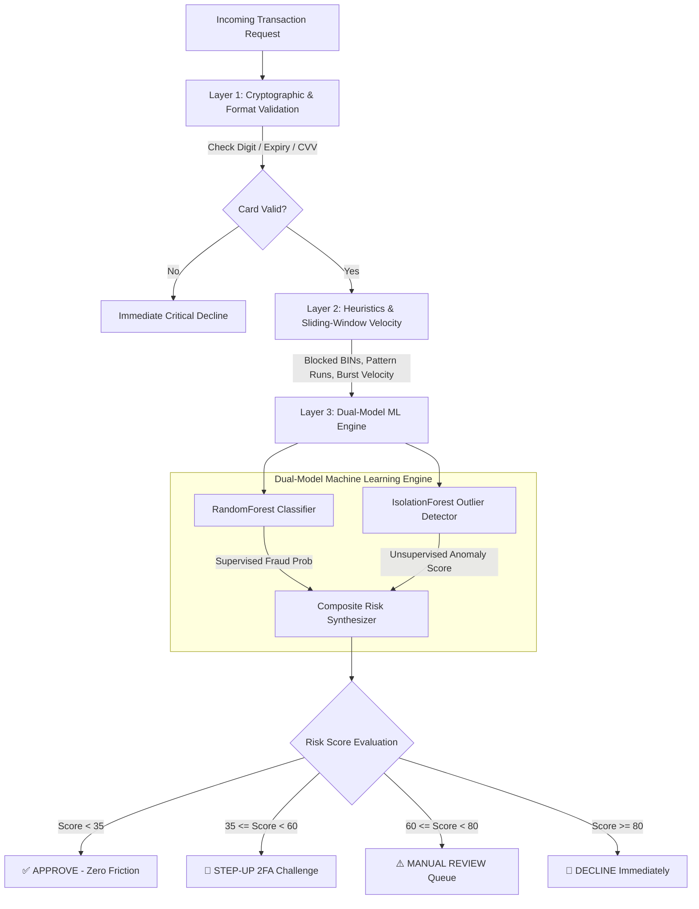

# 🛡️ AegisPay — Real-Time Payment Fraud Classification & Anomaly Detection Pipeline

<div align="center">


<p align="center">
  <strong>An enterprise-grade payment fraud detection engine combining cryptographic card validation, sliding-window velocity heuristics, and dual-model machine learning inference (Random Forest + Isolation Forest).</strong>
</p>

</div>

---

## 🌟 Architecture & Tri-Layer Defense

AegisPay evaluates incoming payment authorizations through a **tri-layer defense pipeline** designed to eliminate false positives while intercepting sophisticated fraud vectors in under **30 milliseconds**:



1. **Layer 1 — Cryptographic & Network Validation**:
   - **Luhn Algorithm Checksum**: Verifies Primary Account Numbers (PAN) using the ISO/IEC 7812 modulus-10 algorithm.
   - **IIN/BIN Recognition**: Accurate pattern detection for Visa, Mastercard, American Express, Discover, RuPay, JCB, Diners Club, and Maestro.
   - **Temporal Expiration & CVV**: Mathematical validation of expiration calendars and scheme-specific card security codes (3 vs 4 digits).

2. **Layer 2 — Deterministic Heuristics & Sliding-Window Velocity**:
   - **Card Testing Detection**: Intercepts micro-authorization probing charges (`$0.01`, `$1.00`) and round-number structuring (`$999.99`, `$4,999.00`).
   - **PAN Structure Analysis**: Flags synthetic test cards with excessive repeating digits or ascending/descending sequences (e.g., `1234`, `4321`).
   - **Sliding-Window Velocity Engine**: In-memory temporal rate limiter monitoring transaction frequency across 10-minute bursts, 1-hour limits, and 24-hour cumulative volume.

3. **Layer 3 — Production ML & Anomaly Detection Pipeline**:
   - **Supervised Classifier**: `RandomForestClassifier` trained on normalized transaction feature vectors (`amount`, `log_amount`, `hour`, `is_night`, `distance_km`, `is_foreign`, `mcc_risk_score`, `device_trust`).
   - **Unsupervised Anomaly Detector**: `IsolationForest` measuring multidimensional deviation from consumer baselines.
   - **Explainability**: Every transaction returns human-readable risk factors explaining exactly why an alert was triggered.

---

## ✨ Key Features

- ⚡ **Sub-30ms Processing Latency**: Lightweight, vectorized feature extraction and inference optimized for payment gateway integration.
- 🎯 **Four-Tier Decision Matrix**: Outputting actionable verdicts (`APPROVE`, `STEP_UP_2FA`, `MANUAL_REVIEW`, `DECLINE`).
- 🖥️ **Interactive Glassmorphism Dashboard**: Embedded real-time web console with instant scenario presets (Grocery, Midnight Crypto, Micro-Probing, Expired Card).
- 📜 **In-Memory Audit Ledger**: Real-time telemetry tracking transactions, latency, card networks, and risk scores.
- 🧪 **Comprehensive Test Suite**: Automated unit tests for Luhn validation, scheme detection, ML inference, and end-to-end scoring.

---

## 🛠️ Project Structure

```
AegisPay/
├── core/
│   ├── __init__.py
│   ├── models.py             # Pydantic data schemas & contracts
│   ├── validator.py          # ISO/IEC 7812 Luhn & network detection
│   ├── rules_engine.py       # Heuristic filters & sliding-window velocity
│   └── ml_engine.py          # Dual RandomForest + IsolationForest pipeline
├── models/
│   └── aegis_fraud_pipeline.joblib # Serialized production model bundle
├── web/
│   └── static/
│       ├── index.html        # Interactive fintech telemetry console
│       ├── style.css         # Glassmorphism dark-theme styling
│       └── app.js            # Real-time controller & scenario runner
├── tests/
│   └── test_aegispay.py      # Automated unit test suite
├── main.py                   # Unified FastAPI server & CLI entry point
├── train_model.py            # Reproducible ML training pipeline
├── requirements.txt          # Production dependencies
└── README.md                 # System documentation
```

---

## 🚀 Quick Start

### 1. Installation

```bash
# Clone the repository
git clone https://github.com/YugNanda/AegisPay.git
cd AegisPay

# Install dependencies
pip install -r requirements.txt
```

### 2. Launch Web Dashboard & API

```bash
python main.py
```
Open your browser at **[http://127.0.0.1:8000](http://127.0.0.1:8000)** to interact with the live telemetry dashboard.

Interactive Swagger API docs are available at **[http://127.0.0.1:8000/docs](http://127.0.0.1:8000/docs)**.

### 3. Run CLI Demo

```bash
python main.py --cli
```

### 4. Run Test Suite

```bash
python -m unittest discover -s tests -p "test_*.py"
```

### 5. Re-Train ML Model

```bash
python train_model.py
```

---

## 📡 REST API Reference

### Analyze Transaction
`POST /api/v1/analyze`

#### Request Payload
```json
{
  "card": {
    "card_number": "4532015698741250",
    "expiry_month": "12",
    "expiry_year": "2028",
    "cvv": "345",
    "cardholder_name": "Jane Doe"
  },
  "amount": 2400.00,
  "currency": "USD",
  "merchant_name": "Offshore Crypto Broker",
  "merchant_category": "cryptocurrency",
  "transaction_hour": 3,
  "distance_from_home_km": 850.0,
  "is_foreign_transaction": true,
  "device_trust_score": 0.20
}
```

#### Sample Response (`200 OK`)
```json
{
  "transaction_id": "tx_a1b2c3d4e5f6",
  "timestamp": "2026-09-15T06:55:00.123Z",
  "card_network": "Visa",
  "masked_card": "4532 01•• •••• 1250",
  "amount": 2400.0,
  "currency": "USD",
  "merchant": "Offshore Crypto Broker",
  "validation": {
    "card_valid": true,
    "luhn_valid": true,
    "card_network": "Visa",
    "expiry_valid": true,
    "expiry_message": "Valid",
    "cvv_valid": true
  },
  "risk": {
    "ml_fraud_probability": 100.0,
    "anomaly_score": 85.9,
    "rules_penalty": 30.0,
    "velocity_penalty": 0.0,
    "total_risk_score": 68.2,
    "risk_tier": "HIGH",
    "decision": "MANUAL_REVIEW"
  },
  "risk_factors": [
    "High-risk merchant category: [CRYPTOCURRENCY]",
    "Elevated transaction volume ($2,400.00) deviates from profile",
    "Geospatial anomaly: 850.0 km from primary billing location",
    "Cross-border payment channel activated",
    "High-risk temporal window (03:00 UTC)",
    "Untrusted device profile (Trust score: 0.20)"
  ],
  "recommendations": [
    "Route transaction to Tier-2 Fraud Analysts for manual authorization.",
    "Request secondary proof of billing address or device token."
  ],
  "processing_time_ms": 24.15
}
```

---

## 👨‍💻 Author & Engineering

Engineered by **[Yug Nanda](https://github.com/YugNanda)**  
Specializing in Systematic Algorithmic Trading, Machine Learning Inference Pipelines, and Scalable Full-Stack Architectures.

---

## 📄 License

This project is licensed under the MIT License — see the [LICENSE](LICENSE) file for details.
